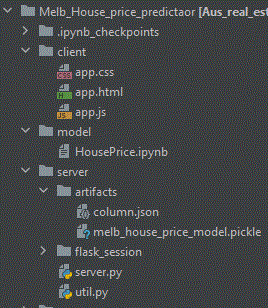
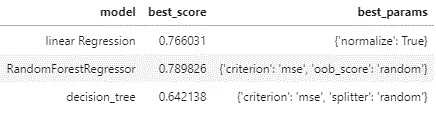
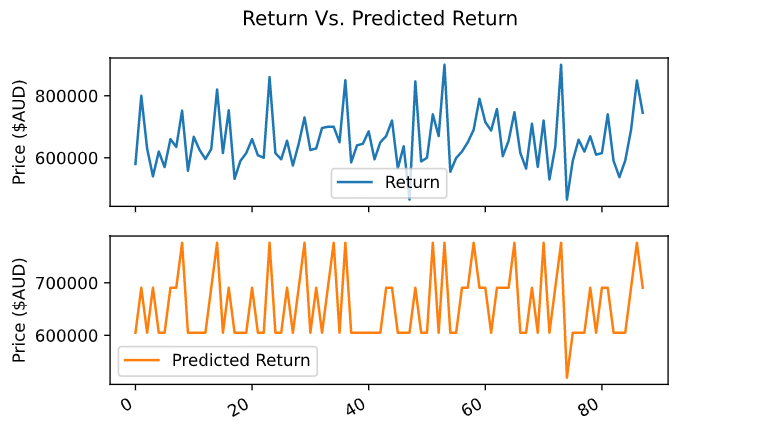

## Table of contents
* [General info](#general-info)
* [Technologies](#technologies)
* [Setup](#setup)
* [Project Directory Structure](#directory-structure)
* [Features](#features)
* [Sources](#sources)

## General info
This project is predicting Melboure House price based on suburb selection.
	
## Technologies
Project is created with:
* Flask version: 1.1.2
* Ajax Javascript version: 3.4.1
* dash library version: 1.19
	
## Setup
To run this project, install flask in your local machine:

```
$ pip install pickle
$ pip install flask
$ cd Melb_house_price_predictor/server
$ python server.py
```

## Directory Structure


## Features
* This entire project is comparing multiple features which are very important as part of Real Estate data analysis to filter out valid data then integrate the dataset using a simple web interface to calcuate house price predictions of Melbourne suburbs based on the Random Forest Regressor Algorithm.
* During our Analysis, Team used following machine learning models to conclude which algorithm works best to predict house prices
	* Linear regression
	* Balanced Random Forest
	* Random Forest Regressor
	* Gradient Boosting Regressor
	* Easy Ensemble Classifier
	* Decision Tree Regressor
* There were two datasets used as part of this project from Kaggle: 
	* 1. Melbourne_houseing_full.csv which has data from 2016 till 2018
	* 2. Aus-property-sales-sep2018-april2020.csv
* Team apply a dimensionality reduction technique to reduce the input features from 21 to 10 in order to perform sanity checks on Melbourne Housing data. For example, the following columns that were not as important to predict house prices: longitude, latititude, loc_pid, lat_pid etc..
* As part of features selection the team used the ChiSquare Test to determine which features are more important to build a house price prediction model.
* The output below is the result from the ChiSquare Test. 
* 
* Team also used estimators like Mean_absolute_error, root_mean_squared_error and R-square value to detemine the relationship between the model and the dependent variable for predicting house price.
* Team also perform feature engineering to generate new feature named price_per_sqm to train the model* 
* For the data cleaning process the following techniques were applied:
    * Remove the rows with null values.
    * Remove the rows where landsize or building area has a 0 value.
    * Remove the rows where building area is greater than landsize.
    * Suburbs with 10 or less properties grouped as 'Other'
* After cleaning the data, we removed price and bedroom outliers from the data.
* To build confidence around the clean data a distribution plot. This was created to visualise the price trend and it was clearly showing less outliners.
* Fit and Train the data using test and train model. Linear-regression algorithm was used to fit the model and find out the score. 
* 
* Use GridSearchCV model to compare LinearRegression, RandomForestRegressor and Decisiontree model to find out the best scoring model
* RandomForestRegressor gave best score of .75
* _Evaluate the trained model(s) using testing data. Include any calculations, metrics, or visualizations needed to evaluate the performance._ -Need to add more details here
* The plot below is of the linear regression model looking at the Australian house price data. With a 80% fit to the data and mean absolute error of $114,352
* 
## Sentiment Analysis
* Team uses sentiment analysis technique to decide on our parameter model for real estate dataset, we used the Word Cloud to support our analysis.
* The word cloud was using new articles that were pulled using the NewsApi searching for the key words 'House Prices Australia'. 
* 
*
* Use this model to predict home price value
* store that model into pickle file and colums into json file
* 
* 
* **more stuff
* stuff**

## Output

* To develop the user interface the following were used: Use HTML, Javascript and FLask. This interface gives the end user an easy way to determine what the median house price is for a chosen suburb based on the selection criteria.  
## Sources
This Webinterface application development is inspired by Machine Learning & Data Science youtube video Tutorial by codebasics


## Create a Jupyter Notebook, Google Colab Notebook, or Amazon SageMaker Notebook to prepare a training and testing dataset.


 ## Fit the model(s) to the training data.


 ## Evaluate the trained model(s) using testing data. Include any calculations, metrics, or visualizations needed to evaluate the performance.


 ## Show the predictions using a sample of new data. Compare the predictions if more than one model is used.


 ## Save PNG images of your visualizations to distribute to the class and instructional team and for inclusion in your presentation and your repo's README.md file.


 ## Use one new machine learning library, machine learning model, or evaluation metric that hasn't been covered in class.


 ## Create a README.md in your repo with a write-up summarizing your project. Be sure to include any usage instructions to set up and use the model.
